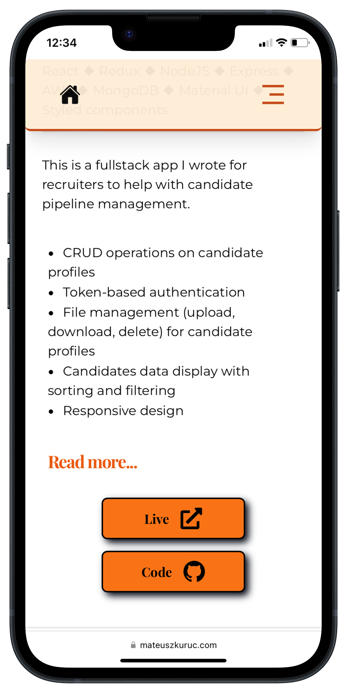
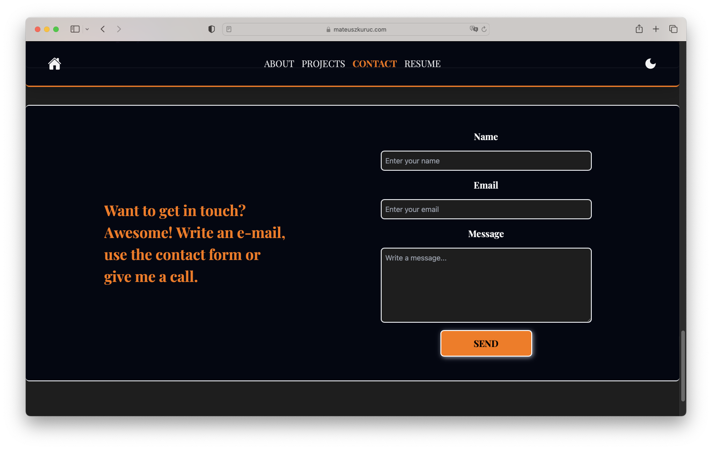
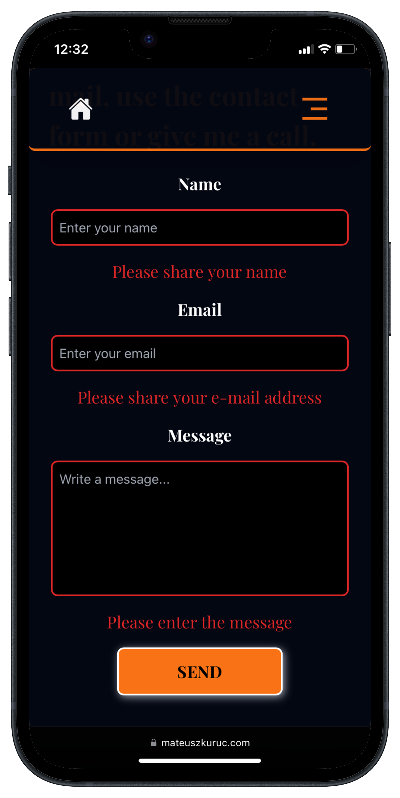
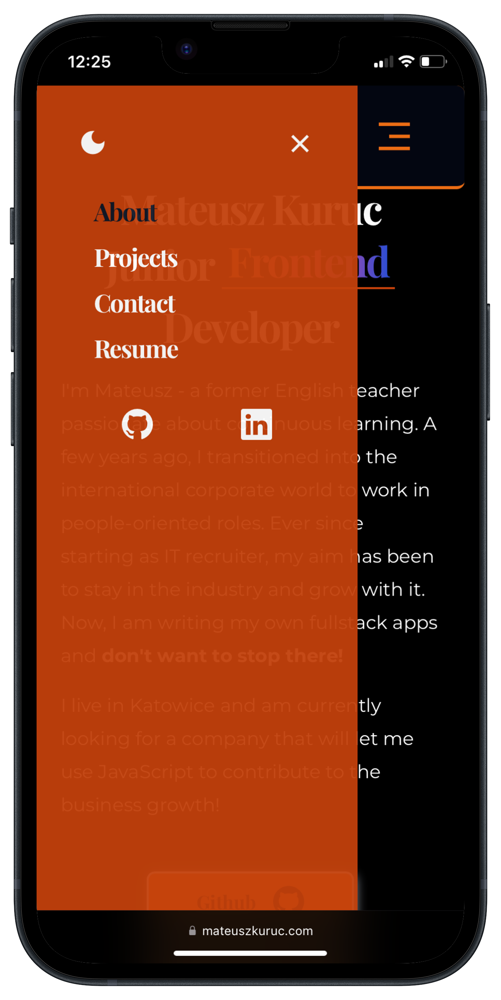
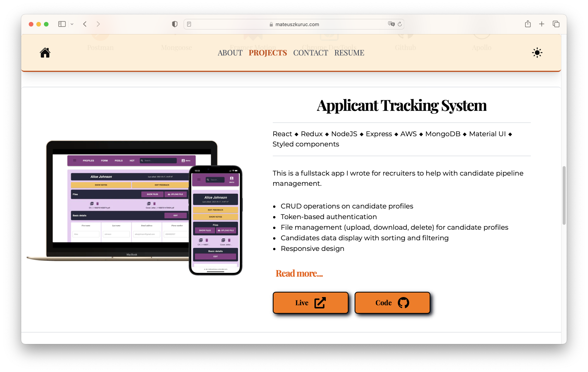

# developer-portfolio

The goal of this project was to build a modern website that will act as my developer portfolio. The site presents my profile, experience and projects I worked on.

🌐 [My Portfolio site live](https://www.mateuszkuruc.com/)

<h2>Goals</h2>

My aim was to make a portfolio website that will serve a few purposes simultaneously. My considerations:

<ul>
  <li>It should show my skills in a concise way and make it easy for people to contact me</li>
  <li>The website needs to prove that I know what I am doing as developer, so smooth experience without hiccups is a must</li>
  <li>Although I am not a designer, I wanted the app to have a unique, but <b>not overwhelming</b> style</li>
  <li>Building this site should teach me something, since I am still developing as a programmer</li>
</ul>

The app is built with <b>Next.js</b> to easily handle routes, keep simple project structure and handle backend requests when needed. For increased type safety and for training purposes, <b>TypeScript</b> was used throughout the whole app. Styling was done with <b>Tailwind CSS</b> due to convenience and developer experience. Animations and page transitions handled by <b>Framer Motion</b>.

Looking at the final results, I believe that I achieved all the key points.

<h2>Technologies</h2>
   
   
   

  

<h2>Key features</h2>
<ul>
  <li>Modern design with colour palette I prepared myself</li>
  <li>Light and Dark mode switcher which fully adjusts design for all sections and subpages</li>
  <li>Contact form validation prepared with Formik and Yup libraries</li>
  <li>Fully automated contact form with the use of Nodemailer library. When the user sends the form, the request is made to backend API and then formatted data sent to my private e-mail at once</li>
  <li>Project section with description and final result mockups for desktop and mobile screens</li>
  <li>Fully responsive design, the app feels and looks equally well on all screen sizes</li>
  <li>Page transitions and reveal animations with Framer Motion</li>
  <li>Subpages for two main portfolio projects with clean design and more text and image content</li>
  <li>Resume subpage with pdf file to download or view</li>
  <li>Playground subpage with description and mockups for 9 smaller projects documenting developer's journey</li>
  <li>Smooth scrolling for navigation, combined with active tab marking</li>
</ul>

<h2>Visual representation</h2>

  

In case of any questions, feel free to contact me directly.
